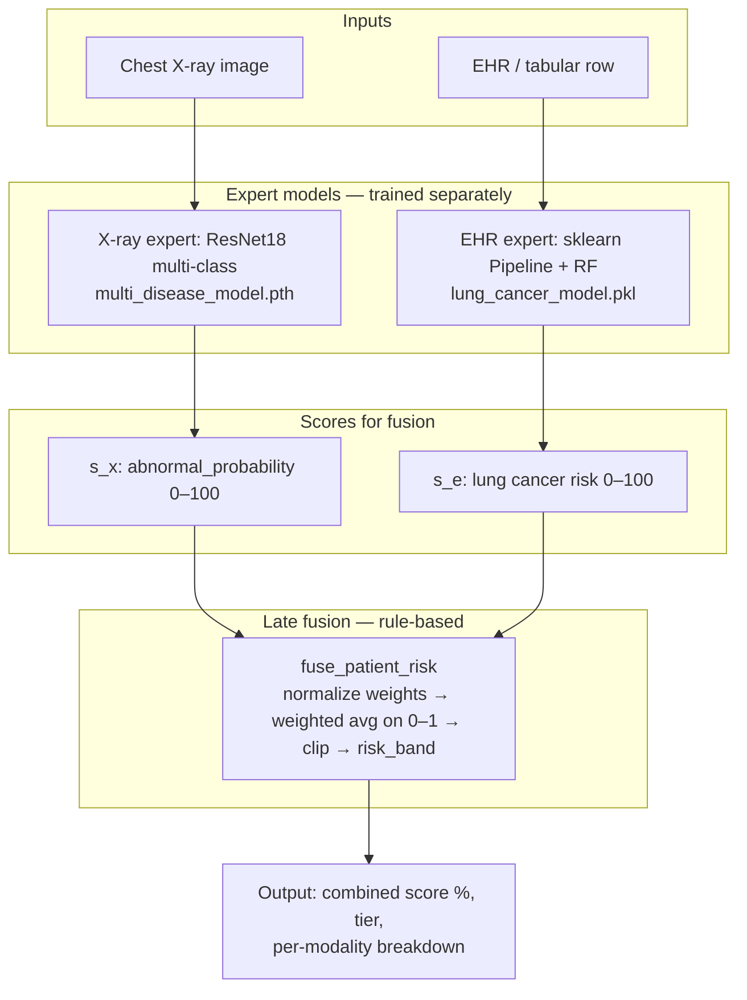
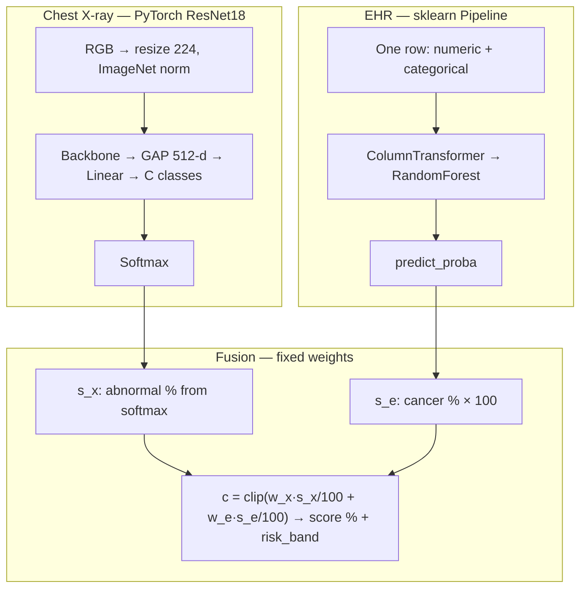
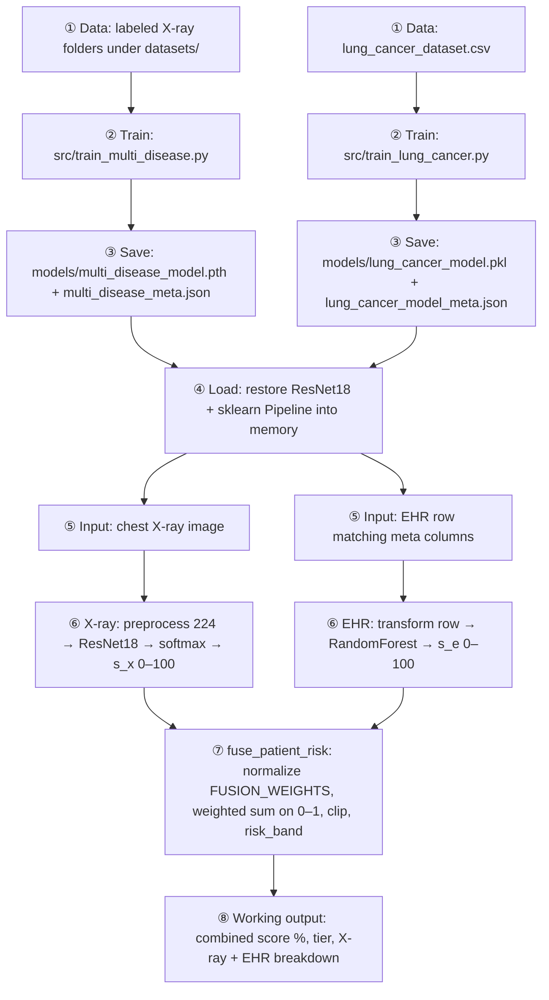
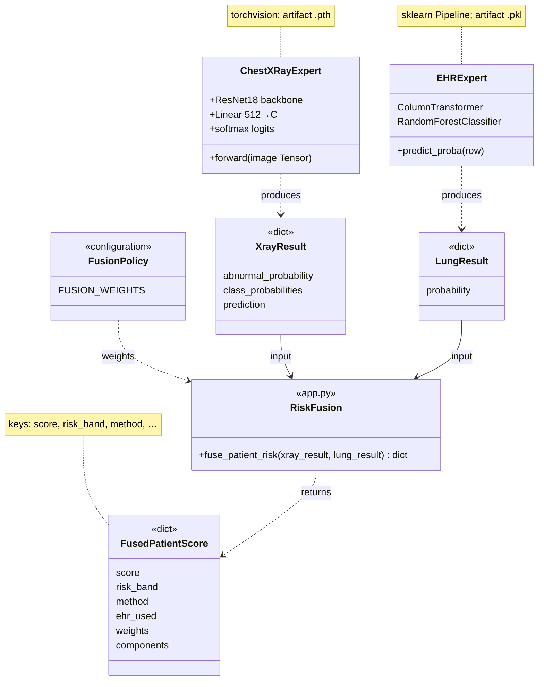
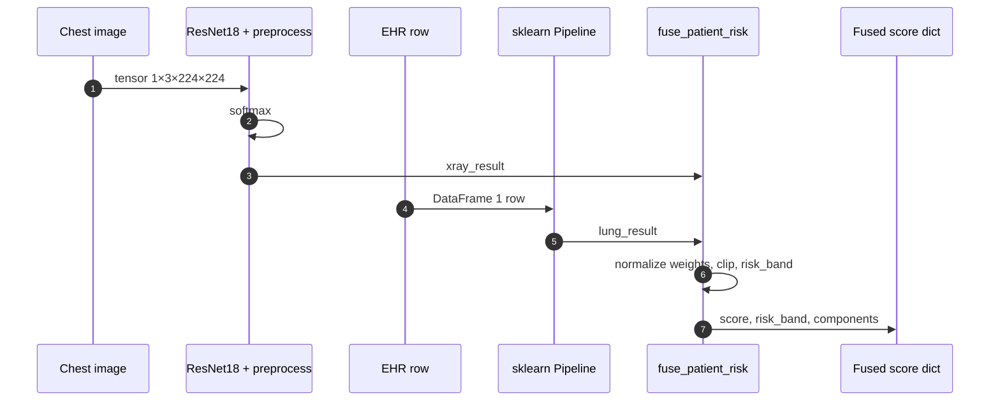

# System architecture & ML diagrams

**Late fusion:** two **independently trained** experts (chest X-ray + EHR/tabular); `fuse_patient_risk` in `app.py` blends two 0–100 scores with `FUSION_WEIGHTS` — **not** a third neural network trained on both modalities.

**Viewing:** [Mermaid](https://mermaid.js.org/) — GitHub / VS Code preview / [mermaid.live](https://mermaid.live).

**Artifacts:** `models/multi_disease_model.pth`, `models/lung_cancer_model.pkl` (+ `*_meta.json`). **Train:** `src/train_multi_disease.py`, `src/train_lung_cancer.py`.

---

## 1. System architecture

High-level ML system: **inputs → modality experts → scores → fusion → patient-level output**.

---

## 2. Model structure

If `multi_disease_model.pth` is missing, legacy 2-class `model.pth` may be used; `s_x` becomes 1 − P(Normal).

---

## 3. Workflow — training to working output (vertical)

No training step optimizes the combined score. Missing EHR → **X-ray only** (EHR weight 0).

---

## 4. UML — class diagram

---

## 5. UML — sequence diagram (combined inference)

---

More detail: [pipline.md](pipline.md) · [README.md](../README.md)
