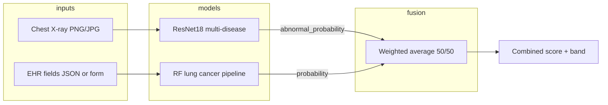

# How the pipeline works

This document describes the **end-to-end flow** for **Respiratory Health AI**: where data comes from, how models are trained, how the web app runs inference, and how the **multi-model fusion** score is produced.

---

## 1. Big picture

The system is a **multi-model, late-fusion** pipeline:

| Stage | Modality | Model | Output used downstream |
| ----- | -------- | ----- | ------------------------ |
| A | Chest X-ray (image) | ResNet18 (5-class) or legacy 2-class | Class probabilities, **abnormal X-ray %** (sum of non-Normal classes), Grad-CAM |
| B | EHR (tabular) | scikit-learn pipeline (preprocess + Random Forest) | **Lung cancer risk %** |
| C | Fusion (no extra neural net) | Weighted average in `app.py` | **Combined respiratory score %** + risk band |

There is **no single neural network** that ingests both image and tabular data at once. Two specialised models run independently; their **final probabilities** are merged in code (`fuse_patient_risk`).

---

## 2. Data pipeline (training)

Raw data lives under **`datasets/`** (not committed if large). Training scripts live under **`src/`** and write artefacts to **`models/`**.

### 2.1 Multi-disease chest X-ray classifier

**Script:** `src/train_multi_disease.py`

1. **Collect** image paths from multiple folders (relative to `datasets/`), one logical label per disease class:
   - Normal, Pneumonia, COVID-19, Tuberculosis, Lung_Opacity (see README for folder mapping).
2. **Cap** samples per class (`--max-per-class`, default 1500) so classes stay balanced.
3. **Split** stratified train / validation (e.g. 80% / 20%).
4. **Augment** (flips, rotation, colour jitter) on training images.
5. **Train** a `torchvision.models.resnet18` head (typically fine-tuning last blocks + classifier) with weighted cross-entropy for class imbalance.
6. **Save** `models/multi_disease_model.pth` and `models/multi_disease_meta.json` (class names, counts, history, metrics).

### 2.2 Legacy 2-class pneumonia model

**Script:** `src/train.py` + `src/data_loader.py`

- Uses Kaggle-style **Normal vs Pneumonia** folders under `datasets/chest_xray/`.
- Saves `models/model.pth`.
- The Flask app uses this **only if** the multi-disease checkpoint is missing (`multi_model is None` in `app.py`).

### 2.3 EHR lung cancer risk model

**Script:** `src/train_lung_cancer.py`

1. **Load** `datasets/lung_cancer_dataset.csv`.
2. **Split** train / test (stratified).
3. **Fit** a `ColumnTransformer` (numeric scaling + categorical one-hot) → `RandomForestClassifier`.
4. **Save** `models/lung_cancer_model.pkl` and `models/lung_cancer_model_meta.json` (feature list, allowed categorical values, metrics).

---

## 3. Application startup (inference prep)

**Entry:** `app.py` (Flask).

When the process starts:

1. **Device:** CUDA if available, else CPU (`torch.device`).
2. **Legacy X-ray model** is built and `model.pth` is loaded (2-class path / fallback).
3. **Multi-disease model** is loaded from `multi_disease_model.pth` if present; class names come from `multi_disease_meta.json`.
4. **Lung cancer pipeline** is loaded from `lung_cancer_model.pkl`; schema from `lung_cancer_model_meta.json`.

Models stay in **eval mode** for inference.

---

## 4. Request pipeline (what happens per HTTP call)

### 4.1 X-ray only — `POST /predict`

1. Client sends **multipart** field `image` (png / jpg / jpeg).
2. Server reads bytes → **PIL Image** → RGB.
3. **`run_multi_disease_inference(image)`**
   - Resize/normalise to **224×224** (ImageNet stats) via `transform`.
   - Forward pass → **softmax** over classes.
   - **Top class** + per-class **probabilities** (as percentages).
   - **`abnormal_probability`**: sum of softmax mass over every class except `Normal` (for multi-disease); for legacy, `1 − P(Normal)`.
   - **Grad-CAM** on `layer4[-1]`, overlaid on the image, returned as a **base64 data URL** PNG.
4. **`disease_recommendations`** adds short text bullets (not medical advice).
5. JSON response: prediction, confidence, probabilities, abnormal %, recommendations, analysis (heatmap + steps).

### 4.2 EHR only — `POST /predict-lung-cancer`

1. Client sends **JSON** or **form** fields matching the meta schema (age, gender, pack_years, exposures, etc.).
2. **`_run_lung_cancer_model`**: validates values, builds a one-row **DataFrame**, runs the sklearn **pipeline.predict_proba**.
3. Maps probability to a **risk band** (Low / Moderate / High / Very High) and **`lung_cancer_recommendations`**.

### 4.3 Combined (fusion) — `POST /predict-combined`

1. Same as X-ray path: **image required** → `run_multi_disease_inference` → `xray` dict.
2. EHR fields read from **`request.form`** (multipart form alongside the file).
3. **`_run_lung_cancer_model`** → `lung_result` dict with `probability` (0–100).
4. **`fuse_patient_risk(xray, lung_result)`**:
   - Converts both inputs to **0–1** and clips.
   - Computes  
     `overall = (w_xray * abnormal_prob) + (w_ehr * cancer_prob)`  
     with default weights **`FUSION_WEIGHTS`**: `xray_abnormal: 0.5`, `ehr_lung_cancer: 0.5` (normalised if you change them).
   - Maps `overall` to a **combined risk band** via `risk_band()`.
5. JSON bundles **`xray`**, **`lung_cancer`**, and **`combined`** (score, band, method, weights, components, summary lines).

**Important:** Fusion is **score-level**. There is no joint dataset label for “fused disease”; the combined number is a **heuristic blend** for the UI, not a fourth classifier trained end-to-end.

---

## 5. Web UI pipeline

| User action | Typical route | Backend |
| ----------- | ------------- | ------- |
| Landing | `GET /` | Renders `landing.html` |
| Upload X-ray | `GET /dashboard` + JS | `POST /predict` from `static/js/app.js` |
| Metrics / charts | `GET /model-accuracy` | Reads `evaluation_results/evaluation_report.json`; images via `GET /evaluation-image/<file>` |
| Re-run charts | Button → `POST /run-evaluation` | Subprocess: `python src/comprehensive_evaluation.py` |

Static assets are served from **`static/`**; HTML from **`templates/`**.

---

## 6. Evaluation pipeline (offline / on-demand)

**Script:** `src/comprehensive_evaluation.py`

1. Loads checkpoints from **`models/`**.
2. Loads or samples validation data from **`datasets/`** (same layout as training).
3. Computes **accuracy, precision, recall, F1**, **confusion matrices**, **ROC** curves per model.
4. Writes **`evaluation_results/`**:
   - `evaluation_report.json`
   - `results_table.csv`
   - PNG plots (confusion matrices, metric bars, ROC).

The **fusion** row in reports is a **summary of separate models**, not a confusion matrix for a single fused classifier (because paired multimodal ground truth is not in scope).

---

## 7. File map (quick reference)

| Piece | Location |
| ----- | -------- |
| Flask + fusion + inference | `app.py` |
| Train multi-disease X-ray | `src/train_multi_disease.py` |
| Train EHR model | `src/train_lung_cancer.py` |
| Train legacy pneumonia | `src/train.py` |
| Full evaluation | `src/comprehensive_evaluation.py` |
| Trained weights | `models/*.pth`, `models/*.pkl`, `models/*.json` |
| Raw data | `datasets/` |
| Generated metrics | `evaluation_results/` |

---

## 8. One-sentence summary

**Data** is prepared under `datasets/` and turned into **`models/`** by **`src/train_*.py`**; **`app.py`** loads those models once, then each request runs **image and/or tabular inference**, and the **combined** endpoint **fuses** the X-ray abnormal signal and the EHR cancer probability with a **fixed weighted average** before returning JSON to the browser.
